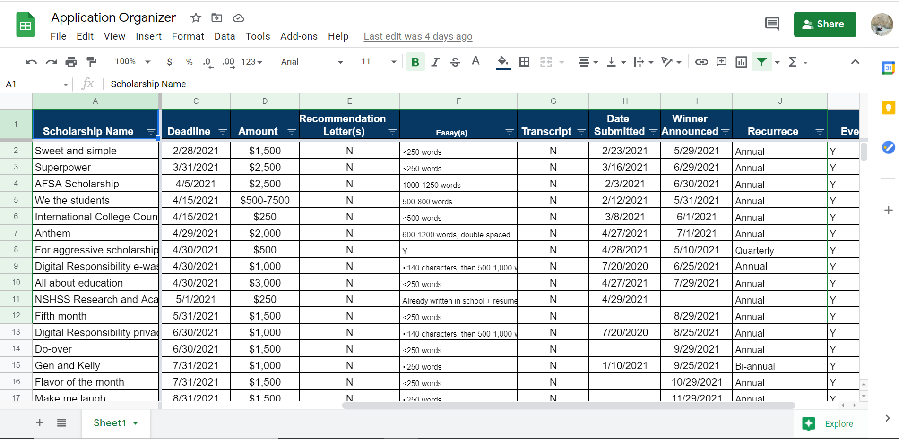
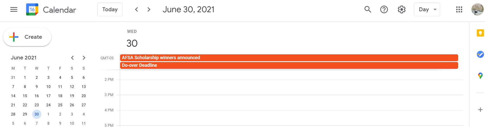
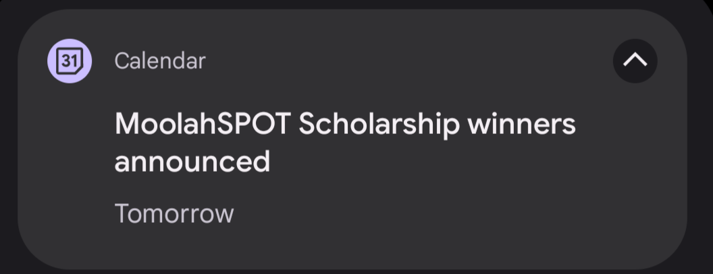

# Scholarship Dates to Google Calendar

## Background 
As college is becoming increasingly expensive, students like me have to rely on scholarships to afford getting a higher education. And there are a lot of scholarships. To keep track of them, I created a spreadsheet with key information about each scholarship that I wanted to apply to. But there was one problem: I had to manually open the spreadsheet every time I wanted to check the deadlines, which I would often forget to do. So I set out to solve this problem.

## Objective
Make the scholarship application process more organized by automatically adding scholarship deadlines and winner announcement dates to Google calendar directly from Google Sheets. Google calendar should then push a notification a day before the deadline to remind the user to submit the application, or to check if winners have been announced on the winner announcement date.

## Tools Used
- Google Sheets API
- Google Calendar API
- Python pandas

## Demo

Scholarships Spreadsheet



Scholarship Dates in the Calendar After Running the Script



Calendar Notification Sent as Set Up by the Script



## Prerequisites
- Python 3.x
- Google Cloud credentials with access to Google Sheets API and Google Calendar API
- Libraries as listed in requirements.txt

## Setup
1. **Clone the Repository**:
   ```bash
   git clone https://github.com/artkha1/scholarship-dates.git
   cd scholarship-dates
   ```
2. **Install required dependencies**:
   ```bash
   pip install -r requirements.txt
   ```
3. **Create a .env file with your credentials - see .env.example**
4. **Run the script**:
   ```bash
   python scholarship_dates.py
   ```
